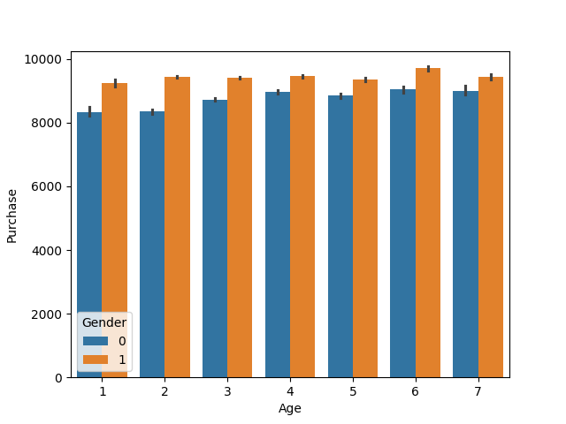
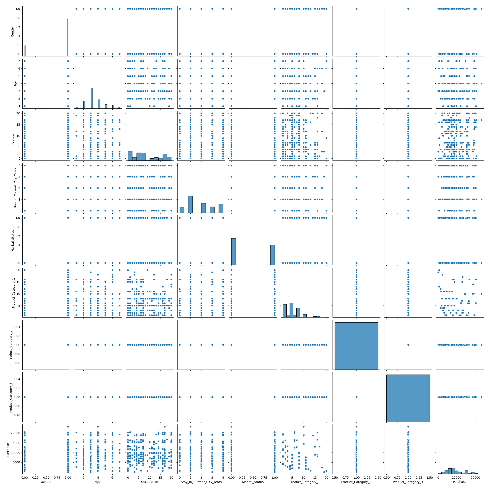
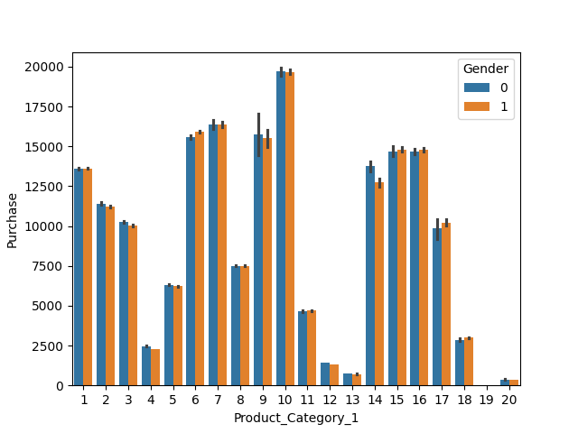
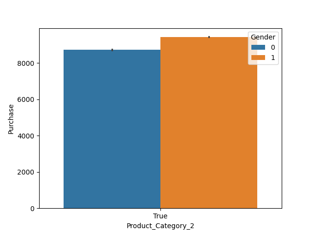

# 🛍️ Black Friday Sales Analysis & Purchase Prediction

This project analyzes customer purchasing patterns using the **Black Friday dataset** from a retail store.  
It includes **EDA, preprocessing, feature engineering, and encoding techniques** to prepare the data for predictive modeling.

---

## 📁 Dataset Summary

- **train.csv** → Customer demographics, product categories, and purchase amount  
- **test.csv** → Same structure as train, but without the `Purchase` column (target)  

### Key Columns
- `User_ID` → Unique customer ID (**removed in preprocessing**)  
- `Product_ID` → Unique product code  
- `Gender` → M/F (**mapped to binary**)  
- `Age` → Categorical (**converted to numerical scale**)  
- `Occupation` → Numerical occupation code  
- `City_Category` → A/B/C (**encoded using one-hot encoding**)  
- `Stay_In_Current_City_Years` → Object → converted to integer  
- `Product_Category_1/2/3` → Main & subcategories of products  
- `Purchase` → Target variable (only in train data)  

---

## 🔍 EDA & Preprocessing Highlights

- Combined **train + test** data for uniform preprocessing  
- Dropped `User_ID` (no predictive power)  
- **Gender** → Mapped `F=0`, `M=1`  
- **Age** → Mapped to ordinal scale (1–7 based on age bracket)  
- **City_Category** → One-hot encoded (`drop_first=True`)  
- **Stay_In_Current_City_Years** → Converted to integer  
- **Product_Category_2/3** → Missing values filled using **mode**  

📊 **Visualizations**:

- **Purchase by Age & Gender**  
  

- **Pairplot of Features**  
  

- **Purchase by Product Category 1**  
  

- **Purchase by Product Category 2**  
  

- **Purchase by Product Category 3**  
  

---

## ⚙️ Techniques Used

- **Pandas** → Data wrangling  
- **Seaborn / Matplotlib** → Visualization  
- **Label Encoding & One-Hot Encoding**  
- **Missing Value Imputation** → Mode for discrete categories  
- **Concatenation & Transformation** of features  

---

## 💡 Key Learnings

- Label encoding works well for **ordinal features** (e.g., Age)  
- Mode imputation is effective for **discrete categories**  
- Removing identifiers (like `User_ID`) → improves generalization  
- One-hot encoding helps with **non-ordinal categorical variables**  

---

## 📈 Next Steps

- Train ML models (Linear Regression, XGBoost, etc.)  
- Apply **hyperparameter tuning**  
- Evaluate using **RMSE, MAE, R²**  
- Perform **feature selection & importance analysis**  
